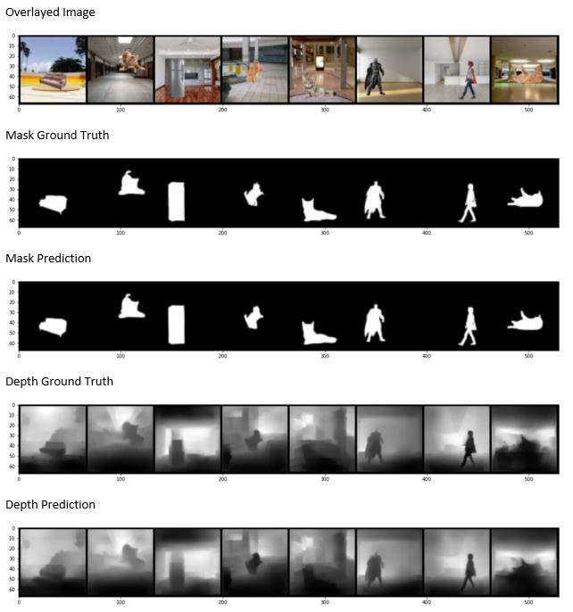

### Problem Statement:
We have 2 inputs: one with only background images (bg) and the other with various foreground objects overlayed on these backgrounds (fg_bg). We also have the Ground Truths for the masks for the foreground objects as well as the depth estimated values as inputs. Ussing these, the objective is to build a supervised learning system that is capable of:  	1. Learning the foreground object's mask in every image by separating out the foreground object using the bg and fg_bg image
	2. Producing the depth map for each image

### Model Architecture:
Most of the existing methods in literature use an encoder-decoder approach for Depth estimation. Even the popular method for segmentation, Unet, follows this approach (even though we are not doing pixel-wise classification here). In fact, the DenseDepth model which was used to generate the Ground Truth Depth maps itself (as a substitute for depth sensors) used a pretrained DenseNet model for encoder and a bilinear upsampling and 2 Conv layers for the decoder. 

So, the same encoder-decoder style architecture is used here. 

In this problem, we have 2 input images and need to produce 2 output images. So we can either consider the same encoder and decoder for both tasks or 2 encoder models (one on each) and then combine the outputs and then similarly use 2 decoder models, one each for depth and mask prediction or third option is to have a single encoder and 2 decoders. The last option is chosen here.  
We use a common encoder which downsamples the inputs and encodes them into a smaller feature set. But while decoding (upsampling), we will have 2 parallel pipelines from the encoded layer - one each for mask and depth prediction. Additionally, we connect layers from the encoder to the decoder, akin to the Unet model. The model has a total of 3.1 M parameters.  The link to the model code is found here : https://github.com/mpaditya/EVA4-B2/blob/master/S15/model_1.py

### Data Loading and Training:
It was noticed while preparing the dataset itself (generating depth images) that extracting all the 400k images (fg_bg) on GDrive was not efficient (zipfile issues, collab crashing/timeout, space etc.). So zip file is loaded directly into Collab memory (the VM assigned for running the Colab notebook) while creating the dataset. So the same technique is used here also. Also, we first try different architectures, loss functions etc. after downsizing the images to (64,64) since it takes lots of memory and long time for 1 epoch on the full size. Moreover, we know that ConvNets can detect all features from (56X56) sized images itself so a 64X64 image is good enough for this task. Only after every single aspect of the solution is finalized, like model architecture, loss functions, evaluation metrics, data augmentation, LR and optimizer etc. we run the final solution on 192X192 once and store the results. 
Also, the input as well as output images are stored on to Drive after every epoch for the sake of analysis, course correction and troubleshooting. Similarly, model is stored after every epoch so that in case of connection issues or Colab crashing, can restart training from where it left off. 

### Data Augmentation:
Since we are trying to do depth estimation, some of the geometric data augmentation techniques like flipping, rotation etc. might cause distortions and cause problems for the network to learn. So, only Color Intensity based strategies like Hue Saturation were tried but did not make any noticeable difference for both depth and mask prediction. So, they were dropped for the final run on (192X192) images. So finally the only transforms applied on both train and test was Normalize and Resize and converted ToTensor.

### Evaluation Metric:
We can build all the wonderful models that we want. But how do we know how good the model really is? How do we know if the model's performance is really improving (and hence model is learning) with every epoch? If we select an inappropriate evaluation criterion, we may be lulled into thinking our model is doing great when actually it isn't. 
We need to define an evaluation metric separately for Depth and Mask prediction. 

For **Mask Prediction**, each pixel output is binary (either it is 0-black or 1-white) and our objective is to get the model to predict the foreground object's mask (white) as accurately as possible. 
We may be tempted to think a pixel-wise accuracy average is good enough. But if the fg object is occupies a small part of the overall image (say < 10% of the total pixels), then the model can get the mask of the fg object horribly wrong & still get good accuracy by just predicting most pixels as 0. 
So, the commonly used metrics for mask prediction are IoU (intersection over union) and Dice Coefficient (F-score). Both are closely related and it is sufficient to use either one. We shall use IoU.

For **Depth Prediction**, every pixel we predict the depth value (quantitative value for depth in [0,1]). So here, unlike mask metric which is more like a classification metric (0 or 1), we need a metric to quantify how different the depth value is from the ground truth (more like a regression metric). We can have multiple metrics for this. The most common metric is RMSE. The other metrics that are used are a threshold based metric - to see if the predicted values lie within (1.25) times the actual value and so on. The reason for using this is to capture the distribution of the predictions around the actual values (RMSE is a single average loss metric - which could be high because of a few pixels which had very different values (outliers) or because most of the pixels were off by a moderate amount; so this threshold metric helps identify this)

### Loss Function:

**Mask Loss -** There are 2 common loss functions used in segmentation tasks: 
	1. Cross entropy - The loss is calculated as the average of per-pixel loss, and the per-pixel loss is calculated discretely, comparing the class predictions with the target label for that pixel. 
	2. Dice loss - this measures the extent of overlap of the predicted mask with the ground truth.

The advantage of the Dice loss are as follows:
	1. It handles class imbalance well - Dice score measures the relative overlap between the prediction and the ground truth (intersection over union). It has the same value for small and large objects both irrespective of the size of the object (even if the fg object occupies a small portion of the fg_bg image). But on the other hand, cross-entropy is evaluated on individual pixels, so large objects contribute more to it than small ones. And mostly in our case (binary - fg/bg), fg is lot smaller than bg. 
	2. The evaluation criteria is also IoU (similar to Dice function) and so the loss function is penalizing the model for exactly what it is going to be evaluated for. 

Disadvantage of Dice loss is that it can result in large gradient which might blow up the loss to a high value whereas the gradients of cross-entropy losses are quite simple and well suited for backpropagation. 

So we try 2 different loss functions for Mask:
	• Only Dice Loss
	• Weighted combination of Dice and Binary Cross Entropy

The Dice+BCE was doing marginally better so that was adopted for the final run. 

**Depth Loss -** For depth prediction, we use the same loss metric used by the DenseDepth model ( https://github.com/ialhashim/DenseDepth/tree/a72e70161d6d2afb2978824ae875310696349472 )
. This loss function is a combination of 3 different loss components:

	1. Depth Loss: This is pixel-wise L1 loss (absolute value of difference)
	2. SSIM loss: This is a structural similarity index based loss
	3. Edge Loss: This is L1 loss defined over the gradient of the depth image

### Notebook for main code implementation: https://github.com/mpaditya/EVA4-B2/blob/master/S15/EVA4_S15B_Aditya.ipynb
### Results:

The average IoU of the predicted fg masks on the test set is 0.81. The average RMSE of the depth predictions on the test set is 0.07. Also,  80% of the depth predictions lie within (1.25) times of their corresponding pixel-wise ground truth values but this quickly rise to 95% for lying within (1.25*1.25) times. The sample input (overlayed fg_bg images) and outputs (both predicted and actual depth and mask images) are shown below for the test set:

