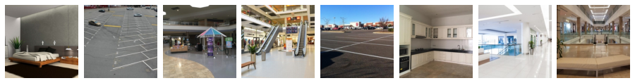
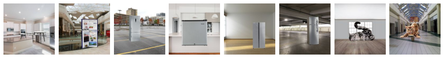
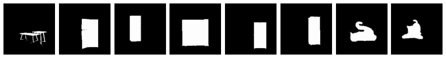
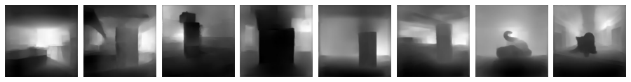

### Dataset Creation

Disclosure: I got the fg and bg images from AK and have used them for my analysis. 

#### Background (bg)
 - Background images like in a mall, inside a kitchn, inside a bedroom, street image etc.
 - 100 such images were downloaded from the internet.

#### Foreground (fg)
 - Images of objects with transparent background
 - The Foreground objects include Batman, dogs, cats, people etc.
 - Using GIMP, the foreground was cutout and the background was made transparent.
 - Number of images: 100 (100 flipped images created while creating fg_bg mentioned below)

#### Foreground Overlayed on Background (fg_bg)
 - For each background
	 - Overlay each foreground randomly 20 times on the background
	 - Flip the foreground and again overlay it randomly 20 times on the background
 - Number of images: 100\*100\*2\*20 = 400,000

#### Foreground Overlayed on Background Mask (fg_bg_mask)
 - For every foreground overlayed on background, its corresponding mask was created.
 - The mask was created by pasting the foreground mask on a black image at the same position the foreground was overlayed.
 -  Image was stored as a grayscale image.
 - Number of images: 400,000

#### Foreground Overlayed on Background Depth Map (fg_bg_depth)
 - For every foreground overlayed on background, its corresponding depth map was generated.
 - A pre-trained monocular depth estimation model [DenseDepth](https://github.com/ialhashim/DenseDepth/blob/master/DenseDepth.ipynb) was used to generate the depth maps.
 - Image was stored as a grayscale image.
 - Number of images: 400,000

The fg_bg images, depth images and mask images were generated using the notebook "EVA4_S15A_DepthModel_Aditya_1.ipynb"

### Dataset Statistics

| Type | Dimensions | Mean | Std |
|---|---|---|---|
| **Background** | (192,192,3) | (0.540, 0.563, 0.581) | (0.203, 0.191, 0.185) |
| **Foreground-Background** | (192,192,3) | (0.525, 0.546, 0.566) | (0.222, 0.213, 0.207) |
| **Foreground-Background Mask** | (192,192,1) | (0.0970) | (0.283) |
| **Foreground-Background Depth** | (224,224,1) | (0.429) | (0.254) |

The statistics were generated using the notebook "EVA4_S15A_Stats_Aditya.ipynb"

### Dataset Link

 - Link: https://drive.google.com/drive/folders/1kig4iNa50ohHp-VPt0HawxYUBuM2q1Qj?usp=sharing
 - Note: The fg_bg, depth and mask images are in zip files since it was not possible to extract them

| Type | Count |
|---|---|
| **Background** | 100 |
| **Foreground** | 100 |
| **Foreground-Background** | 400,000 |
| **Foreground-Background Mask** | 400,000 |
| **Foreground-Background Depth** | 400,000 |

