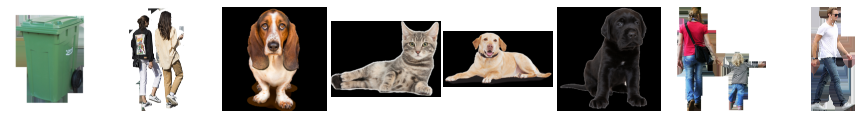

### Dataset Samples
Background:

Foreground:

Foreground Mask:

Foreground-Background:

Foreground-Background Mask:

Foreground-Background Depth:

### Dataset Creation

#### Background (bg)
 - "scene" images. Like the front of shops, etc.
 - 100 images of streets were downloaded from the internet.
 - Each image was resized to 224 x 224
 - Number of images: 100
 - Image dimensions: (224, 224, 3)
 - Directory size: 2.5M
 - Mean: [0.5039, 0.5001, 0.4849]
 - Std: [0.2465, 0.2463, 0.2582]

#### Foreground (fg)
 - Images of objects with transparent background
 - 100 images of footballers were downloaded from the internet.
 - Using GIMP, the foreground was cutout. and the background was made transparent by adding an alpha layer.
 - Each image was rescaled to keep height 105 and resizing width while maintaining aspect ratio.
 - Number of images: 100
 - Image dimensions: (105, width, 4)
 - Directory size: 1.2M

#### Foreground Overlayed on Background (fg_bg)
 - For each background
	 - Overlay each foreground randomly 20 times on the background
	 - Flip the foreground and again overlay it randomly 20 times on the background
 - Number of images: 100\*100\*2\*20 = 400,000
 - Image dimensions: (224, 224, 3)
 - Directory size: 4.2G
 - Mean: [0.5056, 0.4969, 0.4817]
 - Std: [0.2486, 0.2490, 0.2604]

#### Foreground Overlayed on Background Mask (fg_bg_mask)
 - For every foreground overlayed on background, its corresponding mask was created.
 - The mask was created by pasting the foreground mask on a black image at the same position the foreground was overlayed.
 -  Image was stored as a grayscale image.
 - Number of images: 400,000
 - Image dimensions: (224, 224)
 - Directory size: 1.6G
 - Mean: [0.0454]
 - Std: [0.2038]

#### Foreground Overlayed on Background Depth Map (fg_bg_depth)
 - For every foreground overlayed on background, its corresponding depth map was generated.
 - A pre-trained monocular depth estimation model [DenseDepth](https://github.com/ialhashim/DenseDepth/blob/master/DenseDepth.ipynb) was used to generate the depth maps.
 - Image was stored as a grayscale image.
 - Number of images: 400,000
 - Image dimensions: (224, 224)
 - Directory size: 1.6G
 - Mean: [0.4334]
 - Std: [0.2715]

### Dataset Statistics

| Type | Dimensions | Mean | Std |
|---|---|---|---|
| **Background** | (192,192,3) | (0.540, 0.563, 0.581) | (0.203, 0.191, 0.185) |
| **Foreground-Background** | (192,192,3) | (0.525, 0.546, 0.566) | (0.222, 0.213, 0.207) |
| **Foreground-Background Mask** | (192,192,1) | (0.0970) | (0.283) |
| **Foreground-Background Depth** | (224,224,1) | (0.429) | (0.254) |

### Dataset Link

 - Link: https://drive.google.com/drive/folders/1kig4iNa50ohHp-VPt0HawxYUBuM2q1Qj?usp=sharing
 - Note: The fg_bg, depth and mask images are in zip files since it was not possible to extract them

| Type | Count |
|---|---|---|
| **Background** | 100 |
| **Foreground** | 100 |
| **Foreground-Background** | 400,000 |
| **Foreground-Background Mask** | 400,000 |
| **Foreground-Background Depth** | 400,000 |

