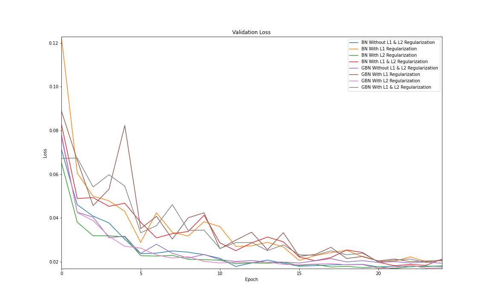
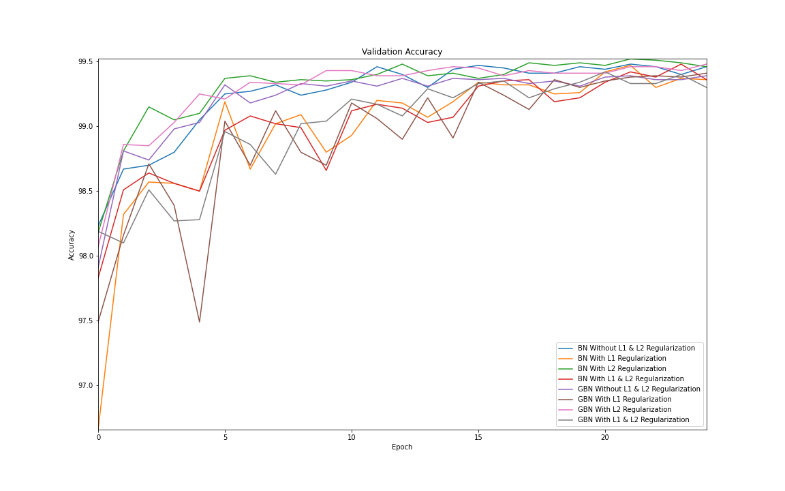
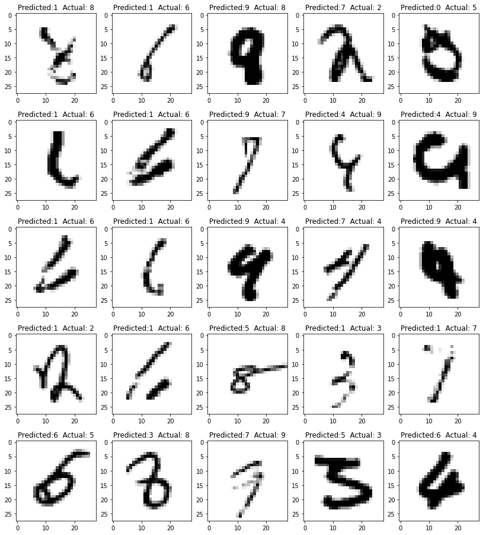

### Assignment S6
This is the folder with the notebook and resulst for Assignment S6. The validation loss and validation accuracy cruves for all 8 combinations of models (BN/GBN, L1, L2 reg) are shown below. Also, the mis-classified images for BN and GBN without L1,L2 Regularization (along with their Predicted and Actual Labels) are also shown below. 

### Analysis
From the loss and accuracy curves, it can be seen that L2 Regularization is more effective in reducing the loss and improving validation accuracy than L1 regularization especially in the initial epochs. As the number of epochs increases (beyond 15-20), the difference in loss and accuracy between the different models reduces. 

From the mis-classified images, it appears that the instances of mis-classification are when the number in the image is not complete or has been rotated by a large degree. 

### Misclassified Images - BN Without L1 or L2 Regularization

### Misclassified Images - GBN Without L1 or L2 Regularization

