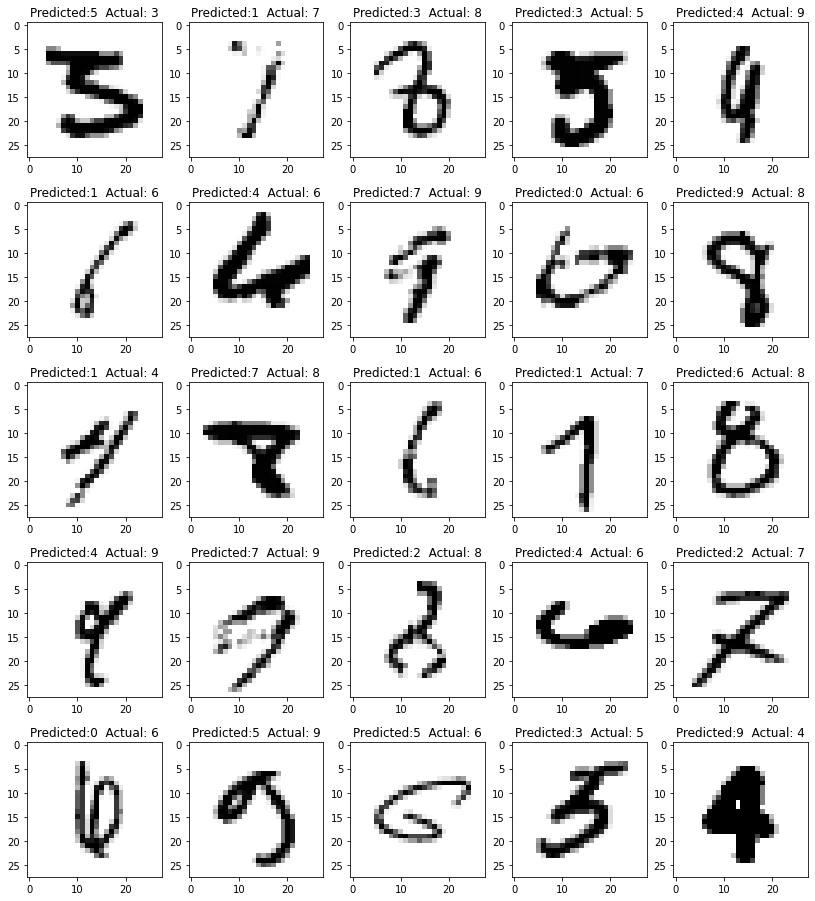

### Assignment S6
This is the folder with the notebook and resulst for Assignment S6. The validation loss and validation accuracy cruves for all 8 combinations of models (BN/GBN, L1, L2 reg) are shown below. Also, the mis-classified images for BN and GBN without L1,L2 Regularization are also shown below. 

